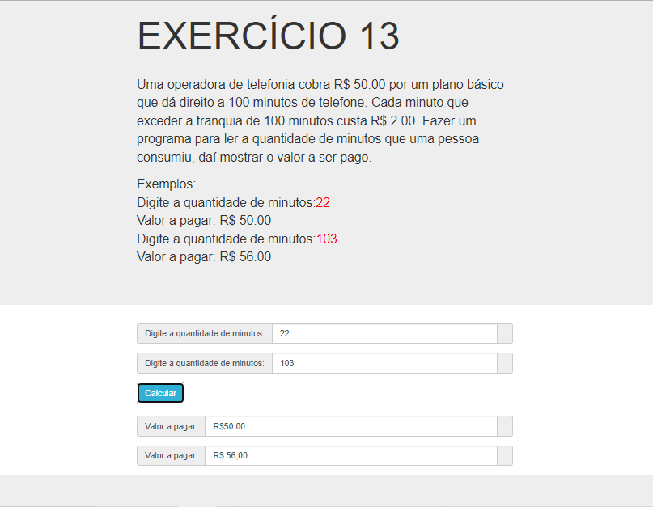

# Jovens Tegranos Exercicio 13

# 🏁 **Tópicos**

 * 👉 Banner
 * 👉 Título e Descrição
 * 👉 Status do Projeto
 * 👉 Funcionalidades
 * 👉 Demonstração da aplicação
 * 👉 Pré-requisitos
 * 👉 Tecnologias utilizadas
 * 👉 Autor
 * 👉 Licença
 
 ____________________________________________________________
# ✅ Banner 👌

<h1 align="center">
  
</h1>

# ✅ Título e Descrição 👌

### Exercicio 13

#### Uma operadora de telefonia cobra R$ 50.00 por um plano básico que dá direito a 100 minutos de telefone. Cada minuto que exceder a franquia de 100 minutos custa R$ 2.00. Fazer um programa para ler a quantidade de minutos que uma pessoa consumiu, daí mostrar o valor a ser pago.
    Exemplos:
    Digite a quantidade de minutos: 22
    Valor a pagar: R$ 50.00
    Digite a quantidade de minutos: 103
    Valor a pagar: R$ 56.00    

# ✅ Status do Projeto 👌

### 🚧 Projeto 🚀 **Concluído com Sucesso!!!** 👌 🚧

# ✅ Funcionalidades 👌

### - [x] Ller a quantidade de minutos que uma pessoa consumiu.
### - [x] Mostrar o valor a ser pago.

# ✅ Demonstração da aplicação 👌

<h1 align="center">
  
</h1>

### GitHub AlineAlmeida85

### Link: [Projeto](https://alinealmeida85.github.io/Jovens-Tegranos-Exercicio13/)

# ✅ Pré-requisitos 👌

### Nenhum, basta clicar no link acima

# ✅ Tecnologias utilizadas ⚒️ 👌

### As seguintes tecnologias foram usadas na construção do projeto:

- [HTML](https://pt.wikipedia.org/wiki/HTML)
- [CSS](https://pt.wikipedia.org/wiki/Cascading_Style_Sheets)
- [JavaScript](https://www.javascript.com/)

# ✅ Autor 👌

### Aline Almeida 💝

# ✅ Licença

### Não Possui

#### Espero que te agrade! ❤️
